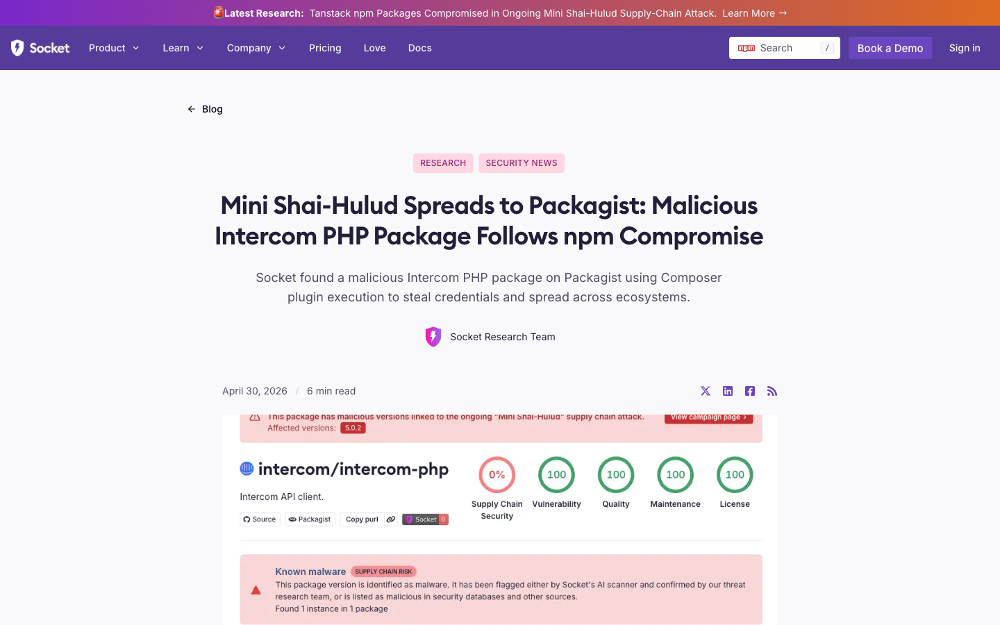

<!-- _class: lead -->
<!-- _paginate: false -->
<!-- _footer: '' -->


# Composer Says No
## Malware Filtering in 2.10

Stephan Vock &nbsp;·&nbsp; @glaubinix
2026-05-15 &nbsp;·&nbsp; packagist.com

---



# In the news

A malicious **`intercom/intercom-php`** release abused **Composer plugin execution** to steal credentials — _Mini Shai-Hulud_ jumping from npm into Packagist.org.

[socket.dev — Apr 30, 2026](https://socket.dev/blog/mini-shai-hulud-packagist-malicious-intercom-php-package-compromise)

---

# The problem is real
#### Intercom PHP — Apr 30, 2026

- `intercom/intercom-php@5.0.2` overwritten with a **malicious release**
- ~20.7M lifetime installs · **~700** on the bad 5.0.2
- Repurposed as a **Composer plugin** → runs at install / update (requires `allow-plugins`)
- Stole **GitHub tokens, SSH keys, AWS / GCP / Azure creds, `.env` files**
- Cross-ecosystem chain: **PyPI** (`lightning`) → **npm** (`intercom-client`) → **Packagist**
- Flagged within **minutes** after release; removed from Packagist.org quickly

---

# Known security vulnerabilities: already covered

Composer already handles them using **FriendsOfPHP/security-advisories** and the **GitHub Advisory Database**.

- `composer audit` **reports** them (**2.4.0** — Aug 2022)
- `composer update` **blocks** them (**2.9.0** — Nov 2025)

But what about **malware**?

---

# Composer 2.9: the catch-all `audit` config

```json
{
    "config": {
        "audit": {
            "abandoned": "report",
            "block-insecure": true,
            "block-abandoned": false,
            "ignore-severity": ["low"],
            "ignore": ["acme/package"],
            "ignore-abandoned": ["acme/abandoned"],
            "ignore-unreachable": false
        }
    }
}
```

---

# Composer 2.10: new `policy` config

Each policy is its own block with a **consistent shape** and **room for more**.

```json
{
    "config": {
        "policy": {
            "abandoned": {
                "audit": "report",
                "block": true,
                "ignore": ["acme/abandoned"]
            },
            "advisories": {
                ...
            },
            "malware": {}
        }
    }
}
```

---

# Composer 2.10: malware filter

`composer audit` **reports** known-malware packages; `composer update` and `composer install` **block** them. **Enabled by default.**

```text
$ composer install
Installing dependencies from lock file (including require-dev)
Verifying lock file contents can be installed on current platform.
Your lock file does not contain a compatible set of packages. Please run composer update.

Problem 1
  - Package acme/library 1.0 (in the lock file) was not loaded, because it was
    flagged as malware (see https://packagist.org/acme/library/filter-lists/malware/)
    reason: malware. To ignore filters for this package, add the package to
    the "policy.malware.ignore" config. To turn the feature off entirely, you
    can set "policy.malware.block" to false.
```

---

# How it works

```text
Aikido feed ──► Packagist.org ──► metadata ──► Composer 2.10
```

- Packagist.org imports the **Aikido malware feed** (CC-BY 4.0)
- `composer update`: inlined in the existing metadata → no extra round-trips
- `composer install`: one HTTP call to fetch summary data from Packagist.org
- No client-side detection (e.g. no local hash comparison)

---

# Try it, break it, tell us

Still **under development** — please test against real projects.

```sh
composer self-update --snapshot   # install the snapshot
composer self-update --rollback   # roll back any time
```

- Report breakage on **`composer/composer`** — every report shrinks the BC surface for stable
- **RC2** soon hopefully (don't use RC1, we've rewritten everything since)
- Ships **on by default** in **2.10**
- Please **do not** try to install actual known-malware packages!

---


# Resources

Meta reference issue for the entire feature:

[Composer issue 12786](https://github.com/composer/composer/issues/12786)

---

<!-- _class: lead -->
<!-- _paginate: false -->
<!-- _footer: '' -->

# Thank you

Stephan Vock &nbsp;·&nbsp; @glaubinix &nbsp;·&nbsp; packagist.com
